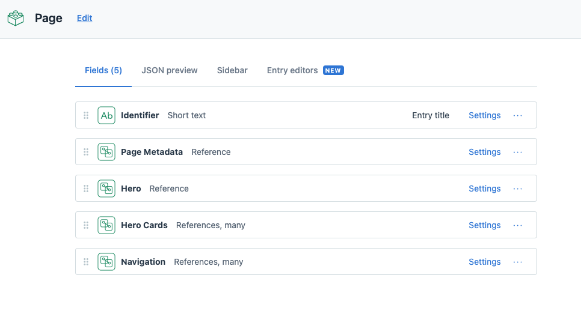
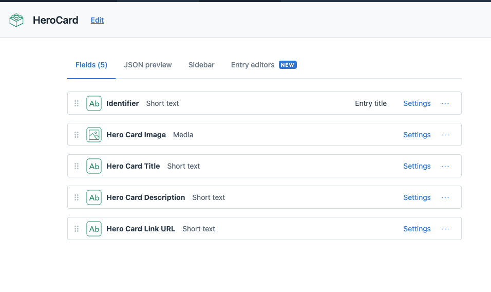

# Brackets

I've hosted the project live on Netlify, (deploying automatically with git hooks)

[https://brackets-takehome.netlify.app/](https://brackets-takehome.netlify.app/) 

I've temporarily made my Github repo public for this project for your review

[https://github.com/remyhunt/brackets](https://github.com/remyhunt/brackets)

## To-Do List

> here are a couple things that I had on my mind, but had run out of time to get done:

- **convert basic CSS sheet to JSX CSS Modules** (had a unique NPM issue related to versioning)
- drop in Page Metadata stored in Contentful in a header component / Helmet
- add a Hamburger menu to the mobile view / nav
- auto generate pages with my Page model in gatsby-node (Althought this was outside of the spec, I designed it this way to be extensible w/ reusable objects in the model)

## Content Modelling

> here are a couple images to demonstrate my content organization. Although I created a page object, those would hypothetically be used for pages which are NOT the homepage.

## page model

## hero cards model
Just one example of the relationships: The page model HasMany reference to Hero Cards (below)
